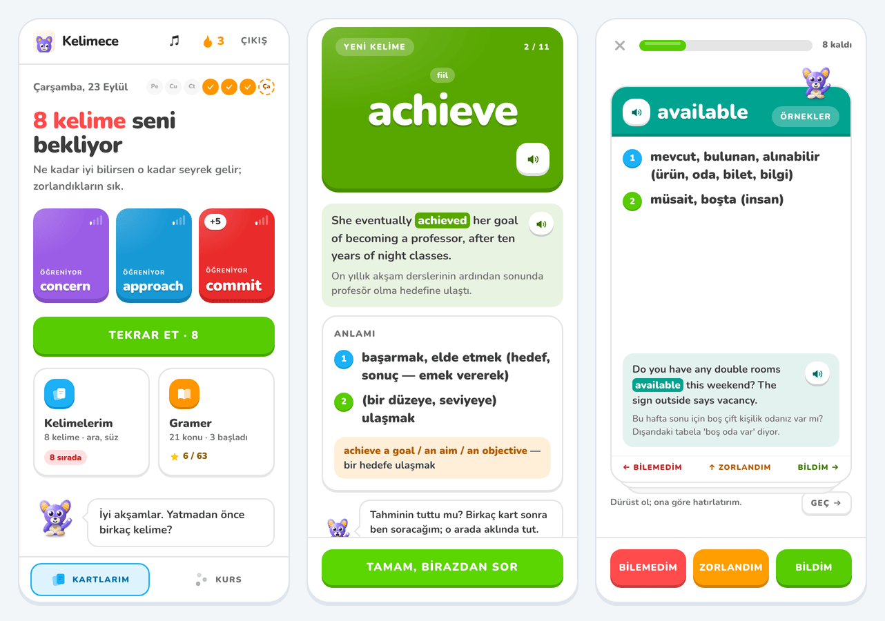
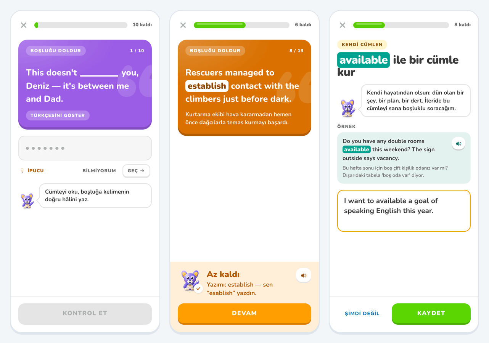
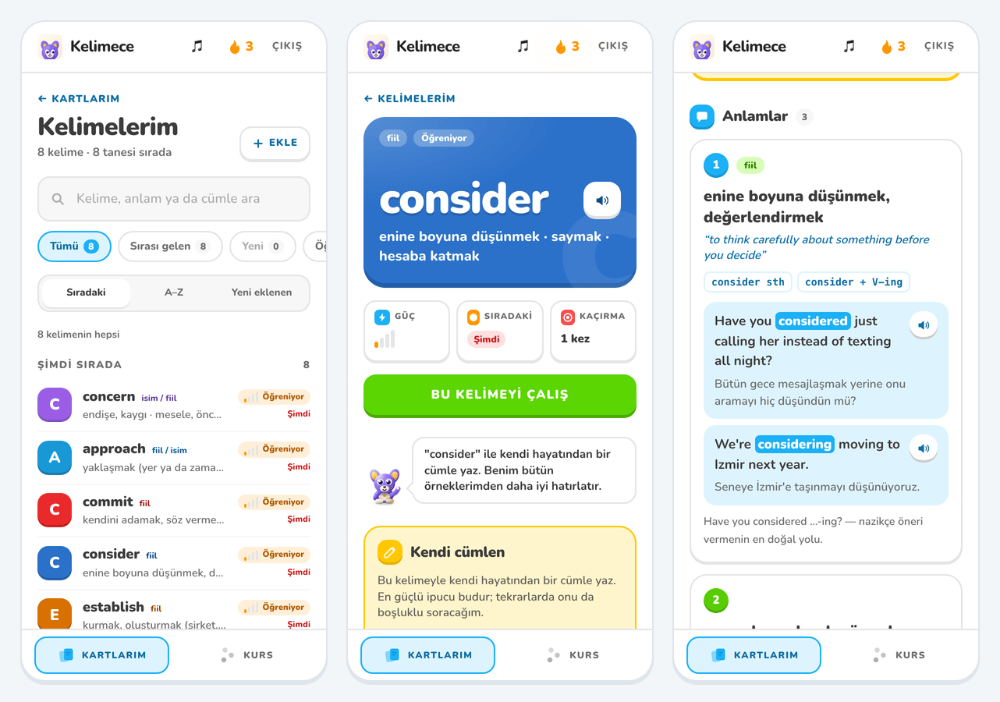
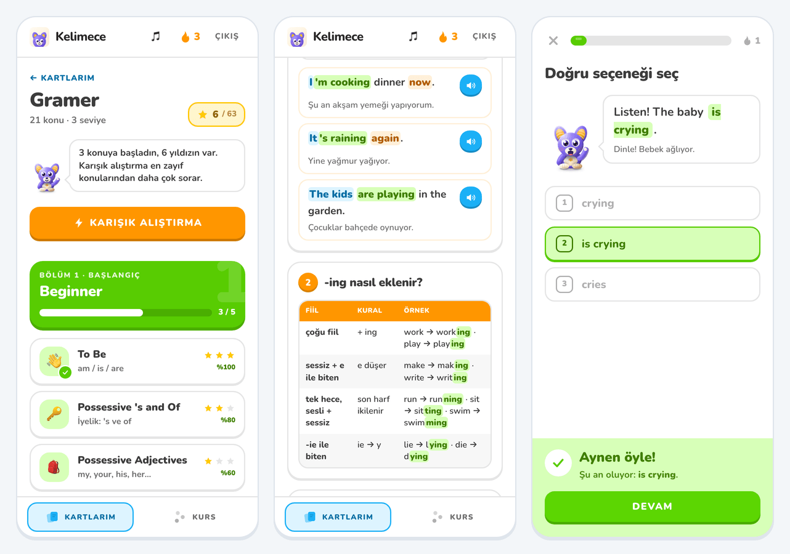
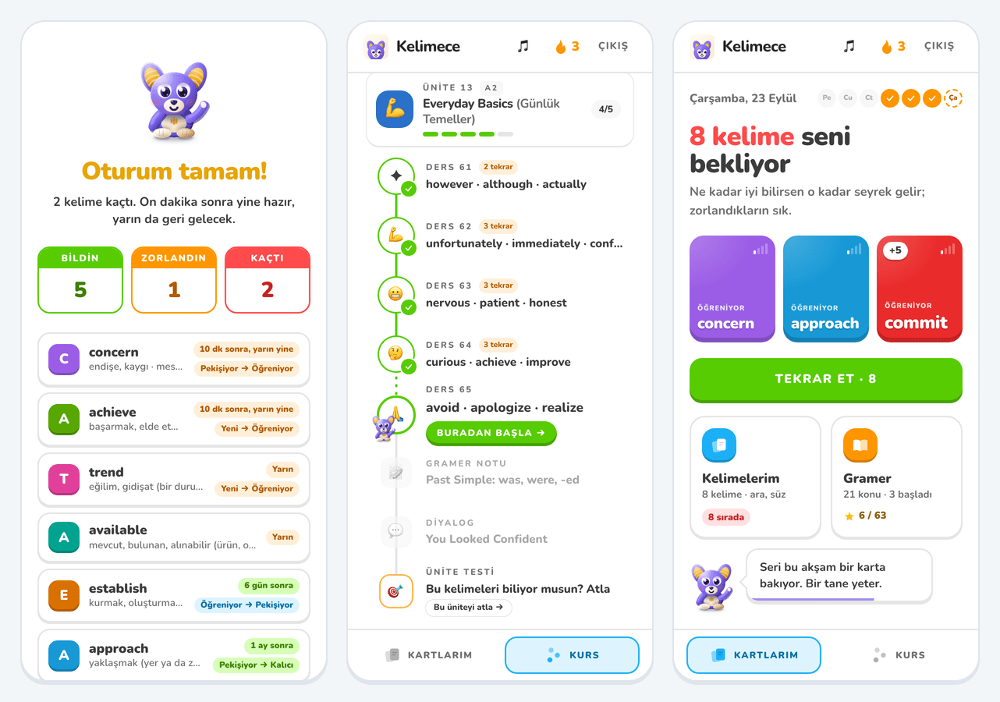

# Kelimece

**English vocabulary for Turkish learners — your own words, asked the way memory needs them, 21 grammar topics to read and practise, a 60-unit course, and Tonton, a character who actually shows up.**

Kelimece is a progressive web app built for one learner first: a few words a day, remembered for good. You add the words you meet in the wild (a series, a street sign, a meeting); the app turns each one into a rich card — meanings in their own colours, a plain-English definition, patterns, example sentences, the chunks it lives in, its family, one thing to watch — and brings it back on an SM-2 schedule. How it asks changes as the word settles: first you recognise it, then you produce it, in its sentences, its chunks and finally a sentence of your own. Beside the words sits the learner's own grammar list — from *to be* to the future — with colour-coded examples and a Duolingo-style quiz for every topic, and a structured A1→C1 course with lessons, dialogues, grammar notes and unit tests.

<p align="center">
  
</p>

## Features

**Practice that follows the memory**
- Every word moves through four stages you can see — *Yeni* (new), *Öğreniyor* (learning), *Pekişiyor* (settling), *Kalıcı* (held) — drawn as signal bars on every card and list row.
- A **new** word is met before it is asked: the word, the word at work in a sentence, a moment to guess what it means, then the meaning. It is asked a few cards later, with a review in between.
- A word being **learned** is recognised: see it, recall the Turkish, flip, grade yourself — swipe right for *Bildim*, left for *Bilemedim*, up for *Zorlandım*. The back always carries one of the word's sentences, the word lit up in its colour. The next day it comes back as a gap in its own sentence, the Turkish open.
- A word that **holds** has to be produced: typed from its Turkish, into its sentence, into one of its chunks (“___ a crime”), by ear, and — once it is yours — into the sentence you wrote with it.
- Typed answers are marked by the app, fairly: the right form scores full marks, the right word in another form (“commit” for “committed”) nearly so, a small spelling slip counts as hard, a hint caps the mark, and “my answer was right too” takes back a wrong mark once. The verdict arrives as a green, orange or red bar with Tonton's face on it.
- A miss comes back three cards later, easier and with its sentence, until it is got; only the first answer of a session is written to the schedule. A word missed three times is marked *inatçı* (a leech) and gets extra support.
- Any card can be passed without marking it — *Geç*, a swipe down, or the down arrow. Nothing is written; it comes back once at the end of the round, and if it's passed again it simply stays due for next time.
- The moment a word is first recalled, you are asked to write a sentence of your own with it — the strongest cue a word can have. Later reviews blank the word out of it.

**Your words, built to grow**
- *Kelimelerim* holds every word the learner has added and is made for hundreds: one search over everything a card says — English or Turkish, with or without the accents (“endise” finds *endişe*) — a filter per stage with its count, three orders (next up, A–Z, newest) with headings that break the list into parts, and pages of forty. Search and filters live in the address, so coming back from a word keeps them.
- The front page keeps only the last five words added, with the way into the full list and into grammar as two tiles.

**Word pages in colour**
- The word on its own bright colour, its short meaning under it, three small cards for strength, when it comes back and how often it slipped, and a green button to drill it.
- Every sense is its own card in its own colour — the same colours the practice screen gives its meanings, so meaning 2 is always the green one — with a plain-English definition, its patterns as chips, and its sentences as soft bubbles: the English with the word lit up, the Turkish beneath in a second voice with the word's counterpart picked out.
- The chunks it lives in, its family, the learner's own sentence, and the one trap split into a red ✗ sentence and a green ✓ one.

**Grammar, the learner's own list**
- 21 topics in three levels (Beginner, Elementary, Pre-Intermediate), in the order they were taught: *to be*, possessives, *have got*, jobs, word types, the present simple, *wh-* questions, sentence order, *to / by / from*, numbers, ordinals and frequency, likes and dislikes, articles, countables, *there is / there are*, quantifiers, the present continuous, imperatives, linking words and the future.
- Each topic is a page to read: sections with a rule, a table and examples whose parts are colour-coded and explained at the top (green for the form being taught, blue for what decides it, orange for a third part such as the time word), the Turkish under every sentence, a voice for every example, the mistakes people make, and Tonton's trick.
- Then ten questions the way Duolingo asks them: pick one, find the wrong sentence, type the gap, or build the sentence from tiles with near-miss tiles mixed in. A green or red bar says why; a miss comes back at the end; the first answers make the score, which is saved as the topic's best with up to three stars. A mixed round draws on the topics already practised, more from the weakest.

**Memory, made visible**
- The front page shows what is waiting, how many words sit at each stage, the next seven days of reviews, and last week's recall rate.
- Each session ends with every word's new stage and when it comes back. Any word can be drilled on its own from its page without touching its schedule.

**A course alongside**
- 60 units, A1 → C1, ~900 words: a lesson path per unit with meet / listen / recall rounds, a short dialogue that puts the unit's words to work, a grammar note in Tonton's voice with a mini quiz, and a unit test that gates the next unit.
- A placement test opens the path at the right level; any unit can be tested out of.

**Tonton**
- The mascot has a director, not a timer: a hello once a day, visits every minute or so on the reading pages (the word list, a word, grammar, the course) with different entrances, a word after most answers in a session, milestones for a run of right answers or a returning card, a nudge when you stare at a card too long, a line on the grammar page you linger on, and an evening word when the streak is at risk. He knows the learner's grammar too: the next topic to open, the one worth another go.
- He is on every question screen in person — guessing a new word with you, reading the sentence you are asked to fill, reacting in the verdict bar — and there is only one of him: when he comes out on a visit, the Tonton drawn into the page steps out of his spot. Long-press hushes him for two hours; dismiss him twice quickly and he takes the hint.

**Built for the phone**
- Installable PWA with an offline shell, Web Push reminders at the hour you choose (sent only when something is actually due), spoken words via the device voice, and a keyboard path for the desktop.

<p align="center">
  
</p>

<p align="center">
  
</p>

<p align="center">
  
</p>

<p align="center">
  
</p>

## Stack

| | |
|---|---|
| **Web** | React 19, TypeScript, Vite 8, Tailwind CSS v4, TanStack Query, React Router 7, `vite-plugin-pwa` (Workbox, custom service worker), Vitest |
| **API** | Node, TypeScript, Express 5, PostgreSQL (`pg`), Zod, JWT + bcrypt, `web-push`, Vitest |
| **Hosting** | Web on Vercel, API on Render, Postgres on Neon, hourly reminder job on GitHub Actions |

## How it works

### Scheduling

Each card carries `repetitions`, `interval` (days) and `ease_factor` (starts at 2.5). A grade below 3 resets the card and brings it back ten minutes later; 3 or above schedules the first success for tomorrow, the second for six days out, and every later one for the previous interval × ease. The ease factor moves with your grades and never drops below 1.3. Due dates are stored as `timestamptz` and land on the learner's local midnight (`LEARNER_TIMEZONE`, default `Europe/Istanbul`), so "tomorrow" means tomorrow whatever hour you studied. Every graded review also lands in `review_log`, which feeds the weekly numbers. See [`backend/src/services/srs.service.ts`](backend/src/services/srs.service.ts) and its tests.

### Practice

[`web/src/lib/practice.ts`](web/src/lib/practice.ts) decides how each word is asked today, from its stage ([`lib/memory.ts`](web/src/lib/memory.ts)) and what its card carries: sentences, chunks, the learner's own sentence, whether sound is on. The choice rotates by day, so a word isn't always met from the same side. A session is built once when it starts — one known word to warm up, new words met in threes and each asked again a few cards later, then the rest in the order they fell due — and grows as misses are put back in. The marking (normalising, inflections, slips counted as an optimal string alignment distance, hints) lives in the same file, and both are covered by tests.

### Cards

A personal card is a small document: `senses[]` (part of speech, meaning, a plain-English `definition`, pattern, a main example with its Turkish and more `examples[]`), `collocations[]`, `related[]`, `watch_out` (written “✗ wrong → ✓ right. Why…” and split for display by [`lib/watchOut.ts`](web/src/lib/watchOut.ts)), the learner's `my_sentence`, a `tint` (the word's own colour), and `lapses` — how many graded reviews it was missed in. The word list's search, filters, orders and headings live in [`lib/wordBrowser.ts`](web/src/lib/wordBrowser.ts), with tests.

### Grammar

The topics ship with the web app as typed content in [`web/src/content/grammar/`](web/src/content/grammar) — `catalog.ts` holds the order and titles (light enough for the home page), one file per level holds the pages. Every English line can carry colour marks (`{form}`, `[subject]`, `<extra>`, `**bold**`, `~~wrong~~`) that [`lib/rich.ts`](web/src/lib/rich.ts) parses and `components/Rich.tsx` draws; each topic's `legend` says what its colours mean. A content test checks every topic: marks closed, table rows as wide as their header, three kinds of question, answers that exist, tiles that really build their sentence. The quiz engine — shuffling, marking, the score, the mixed round weighted towards weak topics — is [`lib/grammarQuiz.ts`](web/src/lib/grammarQuiz.ts). Only the numbers live on the server: `grammar_progress` keeps each topic's best score and attempts.

### Reminders

Turning reminders on stores a Web Push subscription with the chosen hour and timezone. A public, idempotent `POST /api/v1/push/run` is called every hour by [`.github/workflows/reminders.yml`](.github/workflows/reminders.yml); it sends at most one notification per device per local day, and only when cards have been due for at least an hour. VAPID keys are generated once and kept in the `settings` table.

### Design system

*Bright*, after Duolingo's: a white page, white cards with a 2px grey border and a grey ledge under them, and chunky buttons in solid colour on a darker band of themselves that sink when pressed. Eight colour families (grass, ocean, berry, sunny, tangerine, plum, teal, rose), each with a base, a deep shade for the 3D edge, a soft wash and a text-safe ink. Colours keep their meanings: green is *known / go*, orange the honest middle and the streak, red *due / missed*; stages go grey → orange → blue → green. Each word carries a bright colour of its own on its cover, and its senses take the family colours in a fixed order. Nothing is blurred and nothing is black. Tokens, the 3D utilities (`card-3d`, `press`, `press-3d`) and the motion scale live in [`web/src/index.css`](web/src/index.css); the per-word colour in [`web/src/lib/tint.ts`](web/src/lib/tint.ts), the families in [`web/src/lib/palette.ts`](web/src/lib/palette.ts).

## Running it locally

Prerequisites: Node 22+, a Postgres database (Neon, Supabase or local).

```bash
# 1. API
cd backend
cp .env.example .env          # DATABASE_URL, JWT_SECRET, CORS_ORIGIN
psql "$DATABASE_URL" -f schema.sql
npm install
npm run dev                   # http://localhost:3000

# 2. Web
cd ../web
npm install
npm run dev                   # http://localhost:5173
```

Optional API settings: `LEARNER_TIMEZONE` (default `Europe/Istanbul`), `ANTHROPIC_API_KEY` (enables auto-filling a new card's meanings and examples; without it the endpoint answers 503 and everything else works).

Checks:

```bash
cd backend && npx tsc --noEmit && npx vitest run
cd web && npm run lint && npm test && npm run build
```

## API

All routes are under `/api/v1`; everything except `auth/*` and `push/run` needs `Authorization: Bearer <token>`.

| Area | Routes |
|---|---|
| Auth | `POST auth/register`, `POST auth/login` |
| Decks | `GET decks`, `POST decks`, `POST decks/personal`, `PUT decks/:id`, `DELETE decks/:id`, `GET decks/:id/stats` |
| Cards | `GET decks/:id/cards`, `GET decks/:id/cards/due`, `POST decks/:id/cards`, `POST decks/:id/cards/suggest`, `PUT decks/:id/cards/:cardId`, `DELETE decks/:id/cards/:cardId`, `POST decks/:id/cards/:cardId/review` (`{ quality, kind? }`) |
| Course | `GET decks/:id/units`, `POST decks/:id/units/:unitId/result`, `POST decks/:id/placement` |
| Streak | `GET streak`, `POST streak` |
| Grammar | `GET grammar/progress`, `POST grammar/progress` (`{ topic, score }`: keeps the best, counts the attempt) |
| Push | `GET push/key`, `GET push/status`, `POST push/subscribe`, `POST push/unsubscribe`, `POST push/test`, `POST push/run` |

## Project layout

```
flashcards/
├── backend/
│   ├── schema.sql                 users, decks, cards, review_log, units, unit_results, grammar_progress, settings, push_subscriptions
│   ├── content/                   the course: one JSON per unit (words, dialogue, grammar note)
│   └── src/
│       ├── server.ts              Express app, CORS, routes
│       ├── controllers/           auth, deck, card, unit, streak, push, suggest, grammar
│       ├── routes/                one router per controller
│       ├── middleware/            bearer-token check
│       └── services/              SM-2 (srs.service.ts) + tests
├── web/
│   └── src/
│       ├── pages/                 Kartlar (home), Kelimelerim, WordPage, Flashcards (practice), GrammarHub / GrammarTopic / GrammarQuiz, Kurs, Study, UnitTest, Grammar (course notes), Dialogue, Placement, auth
│       ├── components/            Cover, StrengthBars, WordList, WordCardBack, Rich, Mascot, TontonLine, TontonPopups, Sheet, LearningPath, …
│       ├── content/grammar/       the 21 topics: catalog + one file per level, and the content test
│       ├── lib/                   practice + memory, wordBrowser, grammarQuiz, rich, watchOut (all with tests), palette, tint, tonton + tontonDirector, …
│       ├── sw.ts                  service worker: precache + push handlers
│       └── index.css              design tokens, motion scale, utilities
├── docs/screenshots/
└── .github/workflows/             ci.yml (typecheck, tests, lint, build) · reminders.yml (hourly push job)
```

## Deployment

- **Web** — Vercel, root `web/`, build `npm run build`, output `dist/`; set `VITE_API_URL` to the API's `/api/v1` base.
- **API** — Render (or any Node host), root `backend/`, build `npm ci && npm run build`, start `npm start`; set `DATABASE_URL`, `JWT_SECRET`, `CORS_ORIGIN` (the web origin). `GET /` reports the deployed commit.
- **Reminders** — the GitHub Actions cron in `.github/workflows/reminders.yml` calls `push/run` hourly; point it at your API URL.

## Roadmap

- Multi-user onboarding and a native "add a word" flow with automatic meanings and examples
- Speaking practice: say the word, have it checked
- Import from a phone's notes / screenshots
