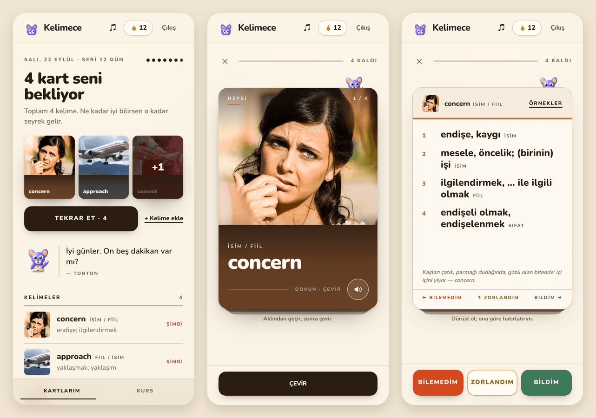
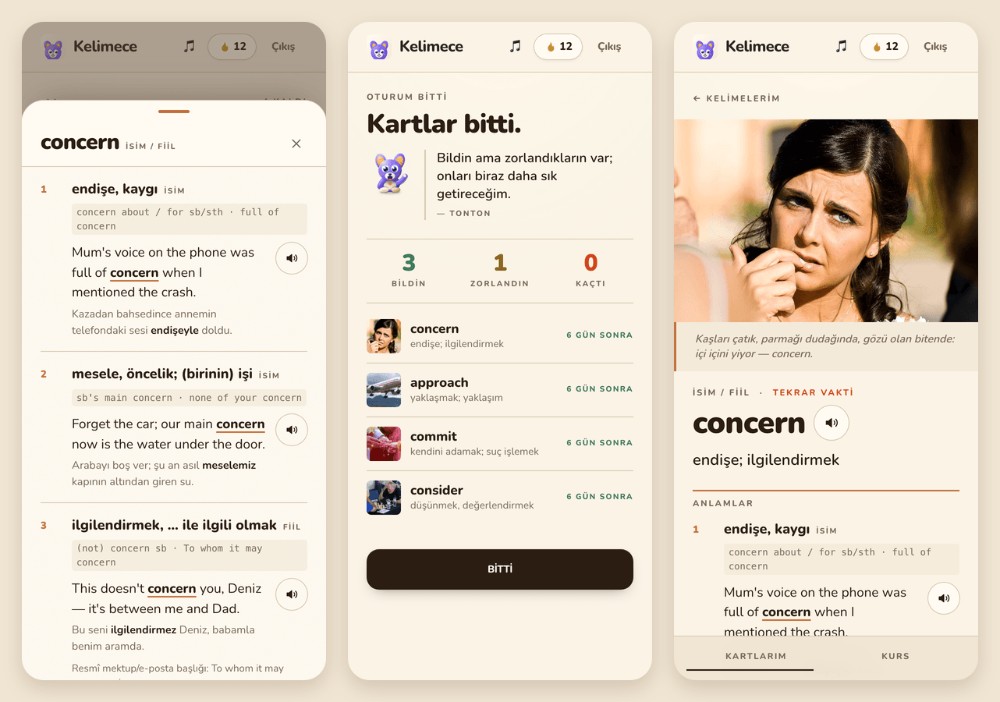
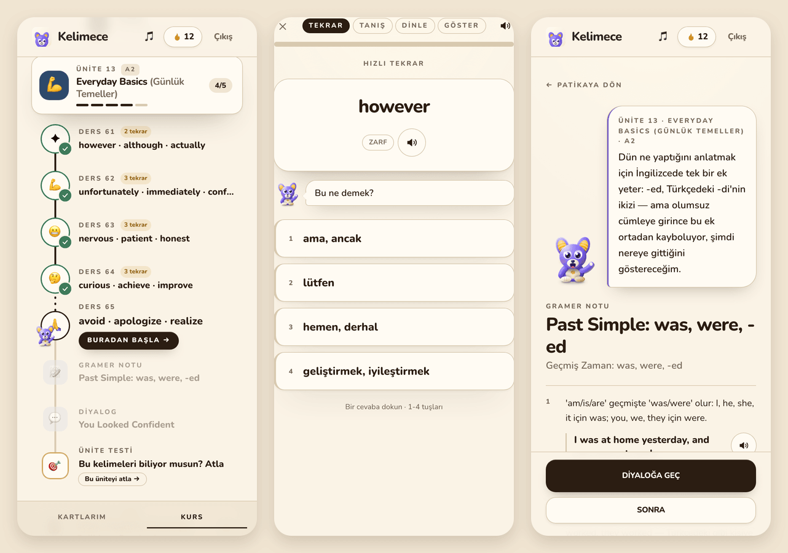
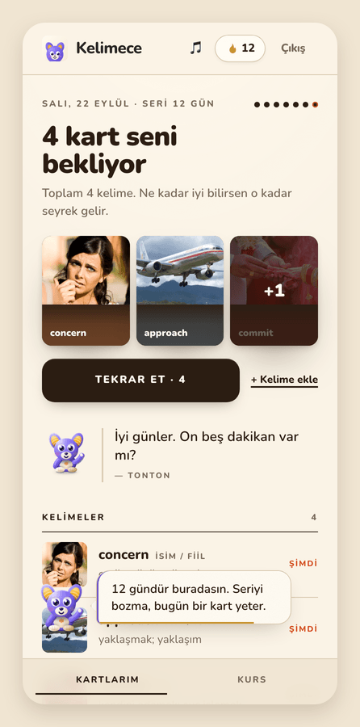

# Kelimece

**English vocabulary for Turkish learners — your own words as magazine-cover flashcards, a 60-unit course, and Tonton, a character who actually shows up.**

Kelimece is a progressive web app built for one learner first: a few words a day, remembered for good. You add the words you meet in the wild (a series, a street sign, a meeting); the app turns each one into a rich card — meanings, patterns, example sentences, the chunks it lives in, its family, one thing to watch — and brings it back on an SM-2 schedule until it sticks. Alongside your own words runs a structured A1→C1 course with lessons, dialogues, grammar notes and unit tests.

<p align="center">
  
</p>

## Features

**Your words, as covers**
- Every word gets a photograph and its own ink pulled from that photo; the card front reads like a magazine cover, the back is numbered meanings on paper. Examples, collocations and related words live on a separate sheet and on the word page, so the card itself stays word + meaning.
- Flip, then swipe: left = didn't know, up = hard, right = knew it. A rubber stamp confirms the verdict; the pile shortens as you go.
- SM-2 scheduling: a lapse comes back in ten minutes, a pass returns at your local midnight on the next interval. "How well you know it" decides how rarely you see it.
- Front page as a dateline: today's streak, what is waiting, a newsstand of the next covers, and the contents list with each word's next review.

**A course, on the same paper**
- 60 units, A1 → C1, ~900 words: a lesson path per unit with meet / listen / recall rounds, a short dialogue that puts the unit's words to work, a grammar note in Tonton's voice with a mini quiz, and a unit test that gates the next unit.
- A placement test opens the path at the right level; any unit can be tested out of.

**Tonton**
- The mascot has a director, not a timer: a hello once a day, unexpected visits with different entrances, reactions to a run of right answers or a returning card, a nudge when you stare at a card too long, and an evening word when the streak is at risk. Long-press hushes him for two hours; dismiss him twice quickly and he takes the hint.

**Built for the phone**
- Installable PWA with an offline shell, Web Push reminders at the hour you choose (sent only when something is actually due), spoken words via the device voice, and a keyboard path for the desktop.

<p align="center">
  
</p>

<p align="center">
  
</p>

<p align="center">
  
</p>

## Stack

| | |
|---|---|
| **Web** | React 19, TypeScript, Vite 8, Tailwind CSS v4, TanStack Query, React Router 7, `vite-plugin-pwa` (Workbox, custom service worker) |
| **API** | Node, TypeScript, Express 5, PostgreSQL (`pg`), Zod, JWT + bcrypt, `web-push`, Vitest |
| **Hosting** | Web on Vercel, API on Render, Postgres on Neon, hourly reminder job on GitHub Actions |

## How it works

### Scheduling

Each card carries `repetitions`, `interval` (days) and `ease_factor` (starts at 2.5). A grade below 3 resets the card and brings it back ten minutes later; 3 or above schedules the first success for tomorrow, the second for six days out, and every later one for the previous interval × ease. The ease factor moves with your grades and never drops below 1.3. Due dates are stored as `timestamptz` and land on the learner's local midnight (`LEARNER_TIMEZONE`, default `Europe/Istanbul`), so "tomorrow" means tomorrow whatever hour you studied. See [`backend/src/services/srs.service.ts`](backend/src/services/srs.service.ts) and its tests.

### Cards

A personal card is a small document: `senses[]` (part of speech, meaning, pattern, example, its Turkish), `collocations[]`, `related[]`, `watch_out`, a one-line `hook` that ties the photo to the word, plus `tint` and `focal` — the colour pulled from the photo and where its subject sits, used by the covers and thumbnails. Photos are resized on upload and stored in Postgres, served by an unguessable token.

### Reminders

Turning reminders on stores a Web Push subscription with the chosen hour and timezone. A public, idempotent `POST /api/v1/push/run` is called every hour by [`.github/workflows/reminders.yml`](.github/workflows/reminders.yml); it sends at most one notification per device per local day, and only when cards have been due for at least an hour. VAPID keys are generated once and kept in the `settings` table.

### Design system

One warm paper in three tints (page, lifted sheet, recessed band), tan hairlines, umber shadows, a bistre ink. Colours carry meaning: vermilion for *due / missed*, moss for *known / later*, gilt for *hard* and the streak. Each word adds a fourth ink from its photograph. The motion scale, keyframes and the `tint-*` utilities live in [`web/src/index.css`](web/src/index.css); the per-word colour helper in [`web/src/lib/tint.ts`](web/src/lib/tint.ts).

## Running it locally

Prerequisites: Node 22+, a Postgres database (Neon, Supabase or local).

```bash
# 1. API
cd backend
cp .env.example .env          # DATABASE_URL, JWT_SECRET, CORS_ORIGIN
psql "$DATABASE_URL" -f schema.sql
npm install
npm run dev                   # http://localhost:3000

# 2. Web
cd ../web
npm install
npm run dev                   # http://localhost:5173
```

Optional API settings: `LEARNER_TIMEZONE` (default `Europe/Istanbul`), `ANTHROPIC_API_KEY` (enables auto-filling a new card's meanings and examples; without it the endpoint answers 503 and everything else works), `PUBLIC_API_URL` (absolute base for image URLs behind a proxy).

Checks:

```bash
cd backend && npx tsc --noEmit && npx vitest run
cd web && npm run lint && npm run build
```

## API

All routes are under `/api/v1`; everything except `auth/*`, `images/:token` and `push/run` needs `Authorization: Bearer <token>`.

| Area | Routes |
|---|---|
| Auth | `POST auth/register`, `POST auth/login` |
| Decks | `GET decks`, `POST decks`, `POST decks/personal`, `PUT decks/:id`, `DELETE decks/:id` |
| Cards | `GET decks/:id/cards`, `GET decks/:id/cards/due`, `POST decks/:id/cards`, `POST decks/:id/cards/suggest`, `PUT decks/:id/cards/:cardId`, `DELETE decks/:id/cards/:cardId`, `POST decks/:id/cards/:cardId/review` |
| Course | `GET decks/:id/units`, `POST decks/:id/units/:unitId/result`, `POST decks/:id/placement` |
| Streak | `GET streak`, `POST streak` |
| Images | `POST images`, `GET images/:token` |
| Push | `GET push/key`, `GET push/status`, `POST push/subscribe`, `POST push/unsubscribe`, `POST push/test`, `POST push/run` |

## Project layout

```
flashcards/
├── backend/
│   ├── schema.sql                 users, decks, cards, units, unit_results, images, settings, push_subscriptions
│   ├── content/                   the course: one JSON per unit (words, dialogue, grammar note)
│   └── src/
│       ├── server.ts              Express app, CORS, routes
│       ├── controllers/           auth, deck, card, unit, streak, image, push, suggest
│       ├── routes/                one router per controller
│       ├── middleware/            bearer-token check
│       └── services/              SM-2 (srs.service.ts) + tests
├── web/
│   └── src/
│       ├── pages/                 Kartlar (home), Flashcards, WordPage, Kurs, Study, UnitTest, Grammar, Dialogue, Placement, auth
│       ├── components/            Mascot, TontonPopups, Sheet, WordCardBack, LearningPath, QuizOptions, …
│       ├── lib/                   api, tint, tonton + tontonDirector, reminders, speech, quiz, path, …
│       ├── sw.ts                  service worker: precache + push handlers
│       └── index.css              design tokens, motion scale, utilities
├── docs/screenshots/
└── .github/workflows/             ci.yml (typecheck, tests, lint, build) · reminders.yml (hourly push job)
```

## Deployment

- **Web** — Vercel, root `web/`, build `npm run build`, output `dist/`; set `VITE_API_URL` to the API's `/api/v1` base.
- **API** — Render (or any Node host), root `backend/`, build `npm ci && npm run build`, start `npm start`; set `DATABASE_URL`, `JWT_SECRET`, `CORS_ORIGIN` (the web origin). `GET /` reports the deployed commit.
- **Reminders** — the GitHub Actions cron in `.github/workflows/reminders.yml` calls `push/run` hourly; point it at your API URL.

## Roadmap

- Multi-user onboarding and a native "add a word" flow with automatic meanings, examples and a photo suggestion
- Import from a phone's notes / screenshots
- A second language pair
