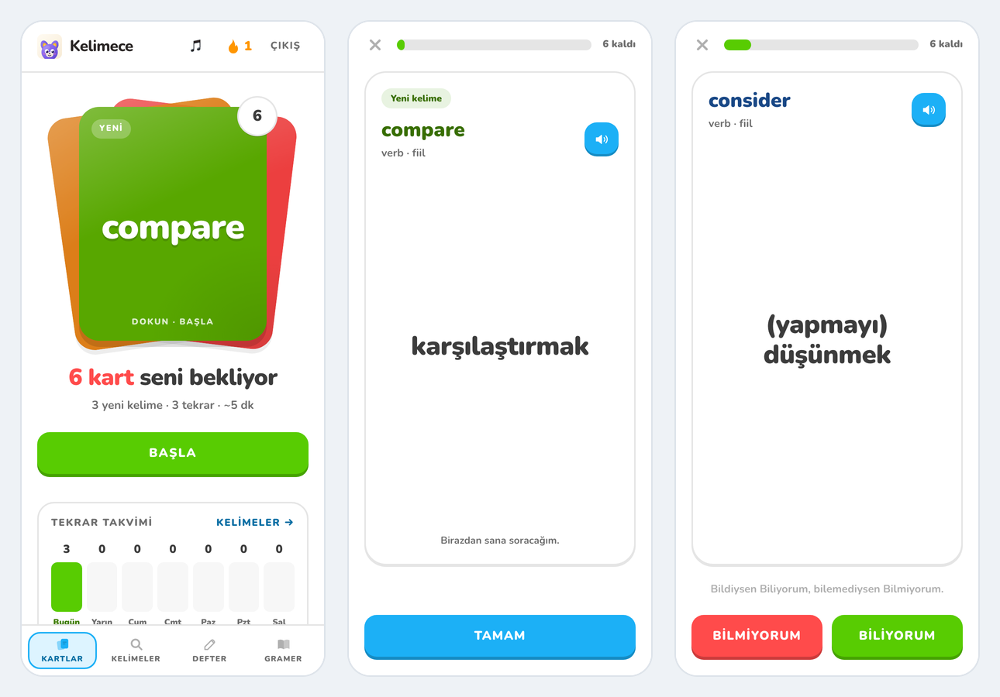
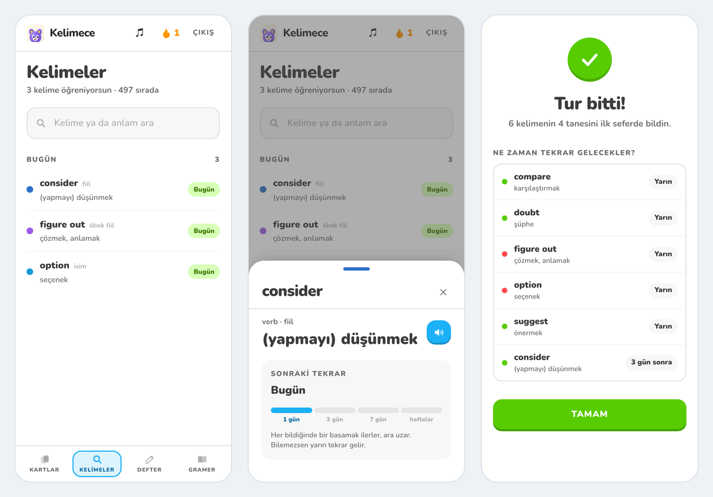
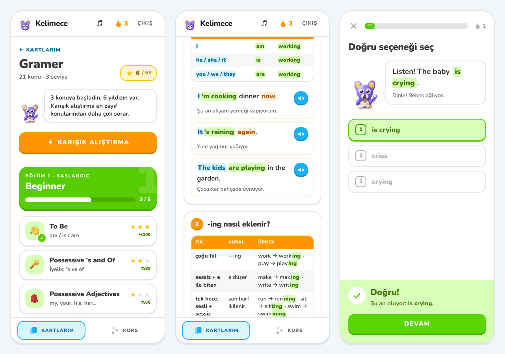
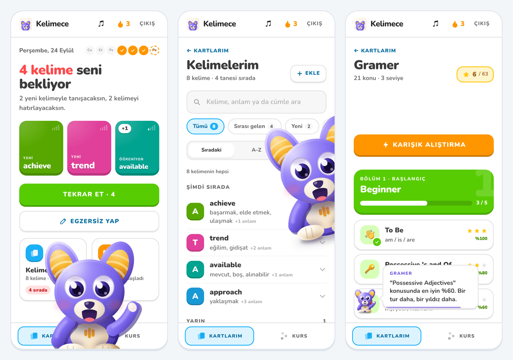
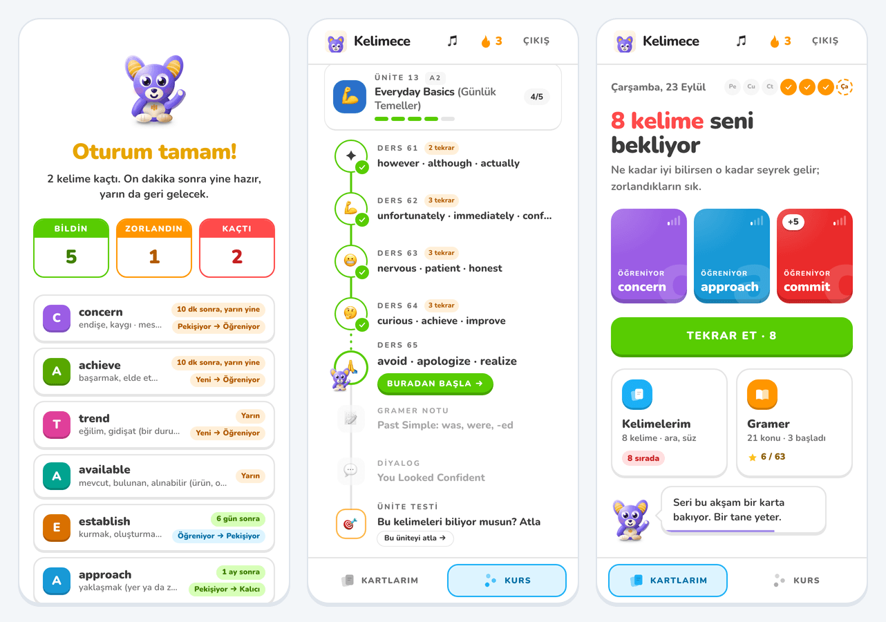

# Kelimece

An English vocabulary app for Turkish speakers, kept simple on purpose: a word, what kind of word it is, what it means, and a schedule that brings it back until it sticks. It also has 24 grammar topics, a notebook for your own words, and a mascot called Tonton.

It's a web app made for the phone (you can install it like a regular app), built around a few minutes of cards a day.

<p align="center">
  
  <br><sub>The home page, a new word being shown, and the back of a card.</sub>
</p>

## Features

### Four tabs

- **Kartlar**: the day's pile and one button. Under it, the review calendar: how many words come back on each of the next seven days.
- **Kelimeler**: every word you have met, grouped by when it comes back (today, tomorrow, this week, later), with its meaning, its part of speech and the day it returns.
- **Defter**: your own notebook, apart from the programme: words met anywhere, written down with their meaning, shown as sticky notes, and shuffled into a round of cards that marks nothing.
- **Gramer**: the grammar topics.

### The words

- You don't pick them: a programme of 500 words, from the end of A2 to B2, ten a week, each week a theme (making decisions, money, work, feelings, health, the economy…). At most three new words come a day, and none on days when too many reviews are waiting.
- A card is the word and its part of speech on the front ("adjective · sıfat"), and its core meaning on the back. Nothing else to read or type.

### A round of cards

- A new word is shown first with its meaning, then asked twice later in the round with other cards in between. At its second right answer it is learned and comes back tomorrow. A miss asks it once more.
- Every other word is asked once: tap to turn it, then *Biliyorum* or *Bilmiyorum*. That answer is the one that counts. A word you didn't know comes back later in the same round, and again tomorrow.
- After every answer the app says when that word comes back ("3 gün sonra tekrar gelecek"), and the end of a round lists every word with its day.
- When nothing is due, *Serbest tekrar* goes through the words you have met without changing anything.
- The cards come in a new order every round, so the order is never what gets learned. A right answer plays a short chime, a miss a soft low tone.

### When a word comes back

- A word you know comes back after 1 day, then 3, then 7, then weeks, the gap growing each time. A word you miss comes back the next day.
- Tap a word in *Kelimeler* to see where it is on that way: the gaps it has passed, the one it is waiting through, and the date it comes back.

<p align="center">
  
  <br><sub>The word list, a word opened, and the end of a round.</sub>
</p>

### Grammar

- 24 topics in four levels (Beginner, Elementary, Pre-Intermediate, Intermediate), in the order they were taught: *to be*, possessives, *have got*, jobs, word types, the present simple, *wh-* questions, word order, *to / by / from*, numbers, ordinals and frequency, likes and dislikes, articles, countable nouns, *there is / there are*, quantifiers, the present continuous, imperatives, linking words, the future, Turkish noun cases (-i, -e, -de, -den) in English, object pronouns and reflexive pronouns.
- **Hatırla**: every topic boiled down to a card to glance at between other things: three to five rules, a few colour-marked examples you can hear, and the one trap a Turkish speaker falls into.
- Each topic is a page to read. It opens with **Bir bakışta**, the topic seen whole: its idea in one sentence, its patterns as one sentence cut into coloured bricks with what goes in each slot written underneath, and Turkish beside English so you see what changes between the two. Chips jump to the sections below: rules, tables and examples. Colours mark the parts of a sentence (green for the form being taught, blue for what decides it, orange for extras such as time words). Every example has a Turkish translation and can be played aloud. The common mistakes come as wrong sentences to fix in your head first, with the right one a tap away. The page ends with the quiz, the topic's Hatırla card and the next topic.
- Each topic has a 10-question quiz: pick the answer, find the wrong sentence, fill the gap, or build the sentence from word tiles with a few extra tiles mixed in. Mistakes come back at the end, and your best score is saved with up to three stars. A mixed quiz takes questions from topics you've already done, more from your weakest ones.

<p align="center">
  
  <br><sub>The grammar topics, a table from the present continuous, and a quiz question.</sub>
</p>

### Tonton

- Tonton says hello once a day, drops by now and then on the word and grammar pages, and keeps out of a round of cards. He knows your grammar scores and points you to the next topic.
- He doesn't always talk. Sometimes he just waves and goes, and every now and then he turns up huge: standing up from the bottom of the screen, leaning in from the side, or popping up in the middle. Tap anywhere and he leaves.
- Press and hold him to mute him for two hours. Close him twice in a row and he gets the hint.

<p align="center">
  
  <br><sub>Tonton's big visits, and a normal one.</sub>
</p>

### The course

- The course has 60 units from A1 to C1 (about 900 words), each with lessons, a short dialogue, a grammar note with a mini quiz, and a unit test. A placement test starts you at the right level.

<p align="center">
  
  <br><sub>The course (hidden while the programme runs).</sub>
</p>

### Made for the phone

- Installable, with an offline shell, words read aloud with the phone's own voice, and keyboard shortcuts on a computer. No notifications: the app doesn't ask for them.

## Stack

| | |
|---|---|
| **Web** | React 19, TypeScript, Vite 8, Tailwind CSS v4, TanStack Query, React Router 7, `vite-plugin-pwa` (Workbox, custom service worker), Vitest |
| **API** | Node, TypeScript, Express 5, PostgreSQL (`pg`), Zod, JWT + bcrypt, `web-push`, Vitest |
| **Hosting** | Web on Vercel, API on Render, Postgres on Neon, hourly reminder job on GitHub Actions |

## How it works

### Scheduling

Each card stores `repetitions`, `interval` (in days) and `ease_factor` (starting at 2.5). The learner's own words use a gentle policy: a word that is known comes back after 1, 3 and 7 days, and after that the interval grows by the ease factor. *Zorlandım* keeps the word on its step and stretches the gap only a little. A miss brings it back the next day; it counts as a lapse only once the word had already held across days, and never on a Turkish-to-English card. The course keeps classic SM-2 (1 day, 6 days, then times the ease), and setting `SRS_POLICY_PERSONAL=classic` puts the own words back on it. The learner's day runs from 04:00 to 04:00 in `LEARNER_TIMEZONE` (default `Europe/Istanbul`), so a session after midnight still belongs to the evening before, and cards fall due at 04:00. See [`backend/src/services/srs.service.ts`](backend/src/services/srs.service.ts) and its tests.

The daily plan ([`backend/src/services/daily.service.ts`](backend/src/services/daily.service.ts)) decides which new words come today: at most three a day across the learner's own words and the course together, the day each word was first written kept in `cards.introduced_on`, and a 409 from the review endpoint if a stale client tries a fourth. Every answer lands in `review_log`: the ones that move the schedule with `scheduled = true`, practice answers (learning steps, repeats, exercises) with `scheduled = false`, each with its phase, direction and think time. The weekly numbers count only the scheduled ones.

### A round

[`web/src/lib/round.ts`](web/src/lib/round.ts) plans a round and decides what each answer does: the new words shown a few cards apart, each asked again three and four cards later, a miss put back three cards on, and which answer is written to the schedule (a review's first answer, a new word's one learning write at its second right answer) and which is only logged as practice. It also works out, the same way the server does, when a word comes back, so the line under the card can say it at once. [`pages/Tur.tsx`](web/src/pages/Tur.tsx) is the screen. The older round with exercises ([`lib/practice.ts`](web/src/lib/practice.ts), [`pages/Flashcards.tsx`](web/src/pages/Flashcards.tsx)) is still what the hidden course uses.

### Cards

A personal card holds `senses[]` (part of speech, meaning, a short `gloss` for the card face, a `tier` saying when it is taught, a plain-English `definition`, pattern, an example with its Turkish, and more `examples[]`), `collocations[]`, `related[]`, `watch_out` (written as "✗ wrong → ✓ right. Why…" and split for display by [`lib/watchOut.ts`](web/src/lib/watchOut.ts)), the learner's `my_sentence`, a `tint` (the word's colour) and `lapses` (how many reviews it was missed in). Search folding ("endise" finds *endişe*) is in [`lib/wordBrowser.ts`](web/src/lib/wordBrowser.ts), with tests.

### Grammar

The topics ship with the web app as typed content in [`web/src/content/grammar/`](web/src/content/grammar). `catalog.ts` has the order and titles (small enough for the home page), and there is one file per level with the pages. English lines can carry colour marks (`{form}`, `[subject]`, `<extra>`, `**bold**`, `~~wrong~~`), which [`lib/rich.ts`](web/src/lib/rich.ts) parses and `components/Rich.tsx` draws. Each topic's `legend` explains its colours. A content test checks every topic: marks are closed, the glance's bricks make a real sentence and fit on a phone, table rows match their header, there are three kinds of question, answers exist, and tiles really build their sentence. The quiz logic (shuffling, marking, scoring, and the mixed quiz weighted towards weak topics) is in [`lib/grammarQuiz.ts`](web/src/lib/grammarQuiz.ts). Only scores are stored on the server: `grammar_progress` keeps each topic's best score and number of attempts.

### Tonton

[`lib/tontonDirector.ts`](web/src/lib/tontonDirector.ts) decides when Tonton appears and what he says: how long to wait between visits, which pages he may visit, how often a visit is silent or full-screen, and when to keep out of the way (he never interrupts a question). [`components/TontonPopups.tsx`](web/src/components/TontonPopups.tsx) only draws the current visit and passes taps back.

### Sounds

The right and wrong answer sounds are two short recordings in [`web/public/sounds/`](web/public/sounds) (see Credits). They are loaded when audio is first allowed and cached for offline use. Everything else, and a fallback until the recordings load, is generated with the Web Audio API in [`lib/sound.ts`](web/src/lib/sound.ts).

### Reminders

The app no longer offers reminders (the learner didn't want notifications), but the server side stays in place. A Web Push subscription holds the chosen hour and timezone. [`.github/workflows/reminders.yml`](.github/workflows/reminders.yml) calls a public, idempotent `POST /api/v1/push/run` every hour. It sends at most one notification per device per day, and only when cards have been due for at least an hour. VAPID keys are generated once and kept in the `settings` table.

### Design

The look is based on Duolingo's: a white page, white cards with a 2px grey border and a grey edge underneath, and solid-colour buttons with a darker bottom edge that press down when tapped. There are eight colour families (grass, ocean, berry, sunny, tangerine, plum, teal, rose), each with a base, a darker shade for the edge, a light background and a readable text colour. Colours keep their meaning: green is right or go, orange is the middle ground and the streak, red is due or missed, and stages go grey, orange, blue, green. Every word has its own bright colour, and its meanings take the family colours in a fixed order. Nothing is blurred and nothing is black. Tokens, the 3D utilities (`card-3d`, `press`, `press-3d`) and animation timings are in [`web/src/index.css`](web/src/index.css), word colours in [`web/src/lib/tint.ts`](web/src/lib/tint.ts), and the families in [`web/src/lib/palette.ts`](web/src/lib/palette.ts).

## Running it locally

You need Node 22+ and a Postgres database (Neon, Supabase or local).

```bash
# 1. API
cd backend
cp .env.example .env          # DATABASE_URL, JWT_SECRET, CORS_ORIGIN
psql "$DATABASE_URL" -f schema.sql
npm install
npm run dev                   # http://localhost:3000

# 2. Web
cd ../web
npm install
npm run dev                   # http://localhost:5173
```

Optional API settings: `LEARNER_TIMEZONE` (default `Europe/Istanbul`) and `ANTHROPIC_API_KEY`, which turns on auto-filling a new card's meanings and examples (kept within the learner's grammar, `LEARNER_GRAMMAR` in `suggest.controller.ts`). Without the key, that one endpoint returns 503 and everything else works.

Checks:

```bash
cd backend && npx tsc --noEmit && npx vitest run
cd web && npm run lint && npm test && npm run build
```

## API

All routes are under `/api/v1`. Everything except `auth/*` and `push/run` needs `Authorization: Bearer <token>`.

| Area | Routes |
|---|---|
| Auth | `POST auth/register`, `POST auth/login` |
| Decks | `GET decks`, `POST decks`, `POST decks/personal`, `PUT decks/:id`, `DELETE decks/:id`, `GET decks/:id/stats` |
| Cards | `GET decks/:id/cards`, `GET decks/:id/cards/due` (own words: `{ cards, plan }`), `GET decks/:id/plan`, `POST decks/:id/cards`, `POST decks/:id/cards/suggest`, `PUT decks/:id/cards/:cardId`, `DELETE decks/:id/cards/:cardId`, `POST decks/:id/cards/:cardId/review` (`{ quality, kind?, phase?, direction?, thinkMs? }`, 409 past the day's three new words), `POST decks/:id/cards/:cardId/practice` (logs an answer that doesn't touch the schedule) |
| Course | `GET decks/:id/units`, `POST decks/:id/units/:unitId/result`, `POST decks/:id/placement` |
| Streak | `GET streak`, `POST streak` |
| Grammar | `GET grammar/progress`, `POST grammar/progress` (`{ topic, score }`, keeps the best score and counts the attempt) |
| Push | `GET push/key`, `GET push/status`, `POST push/subscribe`, `POST push/unsubscribe`, `POST push/test`, `POST push/run` |

## Project layout

```
flashcards/
├── backend/
│   ├── schema.sql                 users, decks, cards, review_log, units, unit_results, grammar_progress, settings, push_subscriptions
│   ├── content/                   the course: one JSON file per unit (words, dialogue, grammar note)
│   └── src/
│       ├── server.ts              Express app, CORS, routes
│       ├── controllers/           auth, deck, card, unit, streak, push, suggest, grammar
│       ├── routes/                one router per controller
│       ├── middleware/            bearer token check
│       └── services/              scheduling (srs), the learner day (day), the daily plan (daily), stats, all with tests
├── web/
│   ├── public/sounds/             the right and wrong answer sounds
│   └── src/
│       ├── pages/                 Kartlar (home), Tur (a round), Kelimelerim (Kelimeler), Defter, WordPage, Flashcards (the course's rounds), GrammarHub, GrammarTopic, GrammarQuiz, Kurs, Study, UnitTest, Grammar (course notes), Dialogue, Placement, auth
│       ├── components/            Cover, StrengthBars, WordList, WordCardBack, MeaningText, Rich, Mascot, TontonLine, TontonPopups, Sheet, LearningPath, …
│       ├── content/grammar/       the 24 topics: catalog, one file per level, and the content test
│       ├── lib/                   practice, learning, senses, memory, day, plan, wordBrowser, grammarQuiz, rich, watchOut (all tested), palette, tint, sound, tonton, tontonDirector, …
│       ├── sw.ts                  service worker: precache and push handlers
│       └── index.css              design tokens, animations, utilities
├── docs/screenshots/
└── .github/workflows/             ci.yml (typecheck, tests, lint, build) and reminders.yml (hourly push job)
```

## Deployment

- **Web**: Vercel, root `web/`, build `npm run build`, output `dist/`. Set `VITE_API_URL` to the API's `/api/v1` base.
- **API**: Render (or any Node host), root `backend/`, build `npm ci && npm run build`, start `npm start`. Set `DATABASE_URL`, `JWT_SECRET` and `CORS_ORIGIN` (the web origin). `GET /` reports the deployed commit.
- **Reminders**: the GitHub Actions cron in `.github/workflows/reminders.yml` calls `push/run` every hour. Point it at your API URL.

## Credits

Both answer sounds come from [Freesound](https://freesound.org) under CC0 (public domain), trimmed and levelled for the app:

- Right answer: ["victory chime"](https://freesound.org/people/1bob/sounds/717771/) by 1bob
- Wrong answer: ["Training Program, Incorrect1.aif"](https://freesound.org/people/timgormly/sounds/181858/) by timgormly

## Roadmap

- Sign-up for more learners, and an "add a word" flow that fills in meanings and examples automatically
- Speaking practice: say the word and have it checked
- Importing words from a phone's notes or screenshots
